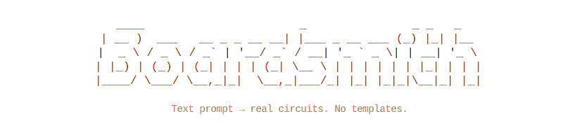
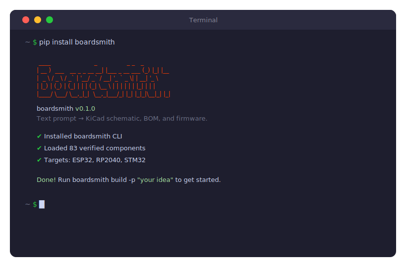
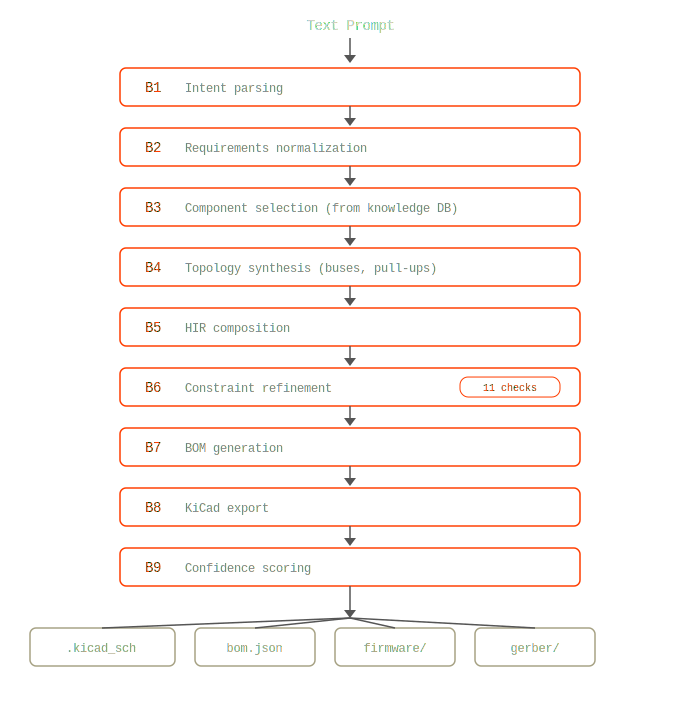

<p align="center">
  
</p>

<p align="center">
  Text prompt → KiCad schematic, BOM, and firmware. No templates — real wired circuits with computed values.
</p>

<p align="center">
  <a href="https://foresthub.ai"></a>
  <a href="LICENSE"></a>
  <a href="https://python.org"></a>
  <a href="https://github.com/ForestHubAI/boardsmith/actions/workflows/ci.yml"></a>
  
  
</p>

<!-- Post-launch badges (uncomment when available):
[](https://pypi.org/project/boardsmith/)
[](https://pypi.org/project/boardsmith/)
[](https://github.com/ForestHubAI/boardsmith)
-->

## Quick Start

```bash
pip install boardsmith
```

Works on Mac, Windows, and Linux. Requires Python 3.10+.

<p align="center">
  
</p>

---

[Why this exists](#why-this-exists) · [Install](#install) · [Examples](#examples) · [How it works](#how-it-works) · [Contributing](#contributing)

---

## Why this exists

Designing a circuit today means: open KiCad, manually place components, look up datasheets for every pull-up value, voltage divider, and decoupling cap. Miss one constraint and the board doesn't work. Every hobby project starts with hours of busywork before you write a single line of firmware.

LLMs changed what's possible — they can write code, generate configs, plan architectures. But hardware has physical constraints that hallucinations destroy. You can't "almost" get a voltage divider right. A wrong pull-up value means the I2C bus doesn't talk. A missing decoupling cap means random resets under load.

**boardsmith treats circuit design like compilation.** You describe what you want in plain English. A 9-stage synthesis pipeline with 11 constraint checks turns that into a real schematic — with every pull-up resistor, every decoupling cap, every I2C address calculated from datasheet specs. The LLM handles intent. The pipeline enforces physics.

The difference: boardsmith works offline (`--no-llm`). It produces real computed values, not templates. Open the output in KiCad — it's a wired schematic with correct nets, not a starting point you have to fix.

## Install

```bash
pip install boardsmith[llm]
export ANTHROPIC_API_KEY=sk-ant-...   # or OPENAI_API_KEY
boardsmith build -p "ESP32 with BME280 temperature sensor"
```

The agent asks one clarifying question (power source?), then iterates until the design passes all constraint checks.

No API key? Run offline with the built-in knowledge base:

```bash
# Offline/demo fallback — no API key required:
pip install boardsmith
boardsmith build -p "ESP32 with BME280 temperature sensor" --no-llm
```

Output lands in `./boardsmith-output/`.

## What it does

boardsmith takes a natural language description and produces four artifacts:

**Schematic** (`schematic.kicad_sch`) — Opens directly in KiCad. Not a template — an actual wired schematic with computed pull-up resistors, decoupling caps, correct I2C addresses, and proper power nets.

**BOM** (`bom.json`) — Line items with manufacturer part numbers, quantities, and estimated cost. Every part comes from the verified knowledge base.

**Firmware** (`firmware/main.cpp` + `hardware.h`) — Arduino or ESP-IDF ready. Pin definitions, init sequences, and peripheral setup generated from the schematic.

**Gerber** (`gerber/`) — JLCPCB-compatible manufacturing files. Board outline, copper layers, drill files. Upload directly to order PCBs.

In v0.2, the LLM also closes the loop: `boardsmith build` automatically repairs ERC violations using a bounded agent loop, and `boardsmith modify` enables surgical patching of existing schematics.

## Examples

```bash
# Weather station
boardsmith build -p "ESP32 with BME280 and SSD1306 OLED display" --no-llm

# CO2 monitor with display
boardsmith build -p "RP2040 CO2 monitor with SCD41 sensor and ST7789 TFT" \
  --target rp2040 --quality high

# LoRa sensor node
boardsmith build -p "ESP32 with SX1276 LoRa and BME280 for remote weather" --no-llm
```

## Supported hardware

| Target | Status | Notes |
|--------|--------|-------|
| ESP32 | **Stable** | ESP-IDF + Arduino, 50+ compatible components |
| RP2040 | **Stable** | Pico SDK, I2C/SPI peripherals |
| STM32 | Beta | STM32 HAL, subset of peripherals |

212 verified components — sensors, displays, comms modules, MCUs, memory, and power. Each with electrical ratings, timing constraints, I2C addresses, and init sequences.

```bash
boardsmith list-components          # browse all 212
boardsmith research BME280          # look up a specific part
```

## How it works

<p align="center">
  
</p>

The pipeline runs 11 constraint checks: voltage compatibility, I2C address conflicts, pin assignment, power budget, timing, decoupling, pull-up values, bus width, clock domains, current limits, and ERC validation.

`--no-llm` runs the full pipeline deterministically — no API key, no network, same output every time. With an LLM, the system iterates and improves designs until confidence exceeds the quality threshold.

The core data structure is [HIR (Hardware Intermediate Representation)](docs/architecture.md) — a typed schema that flows through every stage. It's the contract between the synthesis pipeline and the firmware compiler.

## Agentic EDA (v0.2)

Boardsmith v0.2 adds a closed-loop LLM-guided EDA layer on top of the v0.1 synthesis pipeline.

### ERCAgent — Automatic ERC Repair

After schematic generation, `boardsmith build` automatically invokes the ERCAgent if LLM credentials are available. The agent:

- Reads real KiCad ERC output via `RunERCTool`
- Asks the LLM to reason about each violation
- Applies surgical patches via `WriteSchematicPatchTool` (ADD/MODIFY only — no destructive deletes)
- Repeats up to 5 iterations with stall detection (same violations twice = stop)
- Reports remaining violations in plain English if the cap is hit

Control the iteration cap: `boardsmith build --max-erc-iterations 3`

### boardsmith modify — Brownfield Schematic Patching

Patch an existing KiCad schematic without touching the B1–B9 pipeline:

```bash
boardsmith modify existing.kicad_sch "add battery management with TP4056"
```

Flow:
1. LLM reads the schematic and generates a structured modification plan
2. Plan is displayed — you confirm (or pass `--yes` to skip)
3. Patches are applied; ERCAgent validates post-patch
4. A timestamped `.bak` backup is created before any write

> **Note:** `boardsmith modify` does not update the HIR. Run `boardsmith build --from-schematic` to re-sync.

### boardsmith verify — Semantic Design Verification

Check a schematic's design intent against the HIR:

```bash
boardsmith verify path/to/design.kicad_sch --hir path/to/design.hir.json
```

Runs the SemanticVerificationAgent — 6 rule-based tools followed by an LLM-guided fix loop:

| Tool | What it checks |
|------|----------------|
| VerifyConnectivityTool | All HIR buses have matching schematic nets |
| VerifyBootabilityTool | Boot pins, reset circuits, oscillator config |
| VerifyPowerTool | Power rails, decoupling, voltage domains |
| VerifyComponentsTool | All HIR components present with correct roles |
| VerifyBomTool | BOM CSV matches HIR component list |
| VerifyPcbBasicTool | All schematic refs present in PCB layout |

Requires `pip install boardsmith[llm]`. No `--no-llm` fallback (rule-based checks are free; LLM fixes require a key).

## Contributing

The fastest way to contribute: **add a component to the knowledge base**. It's a Python TypedDict with electrical specs from the datasheet. Takes about 20 minutes. Every new component immediately makes boardsmith more useful for everyone who needs that part.

```bash
# 1. Add your component to shared/knowledge/seed/sensor.py (or display.py, etc.)
# 2. Smoke test
boardsmith build -p "ESP32 with <your-component>" --no-llm --no-pcb
# 3. Run tests
pytest
# 4. Open a PR
```

See [CONTRIBUTING.md](CONTRIBUTING.md) for the full guide, component schema, and other ways to help.

## License

[AGPL-3.0](LICENSE) — use it, modify it, ship improvements back.

Commercial license available for closed-source integration. Contact root@foresthub.ai.
