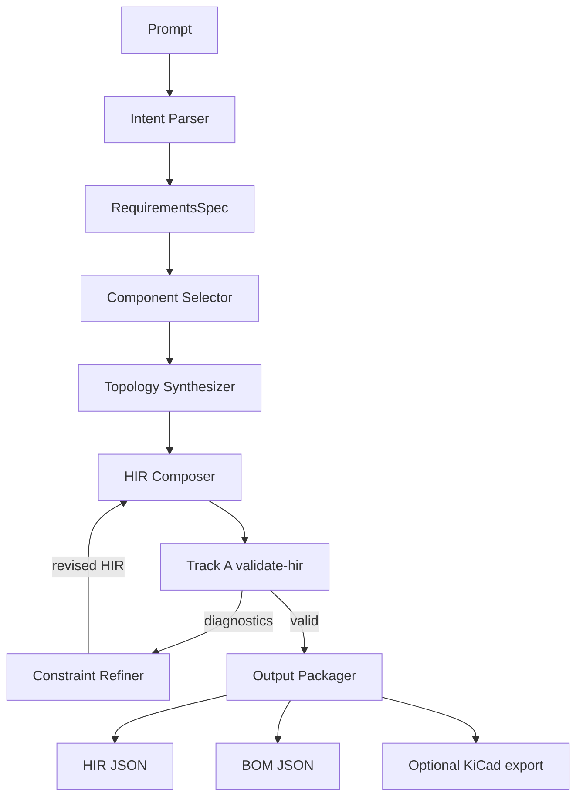
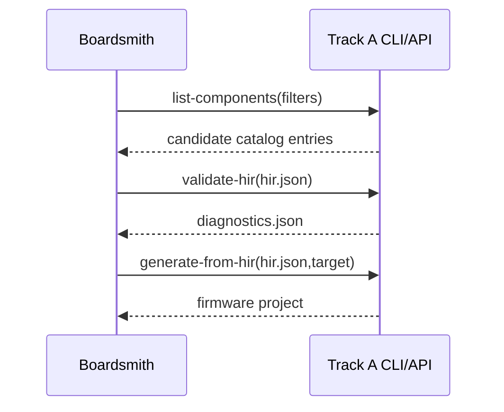
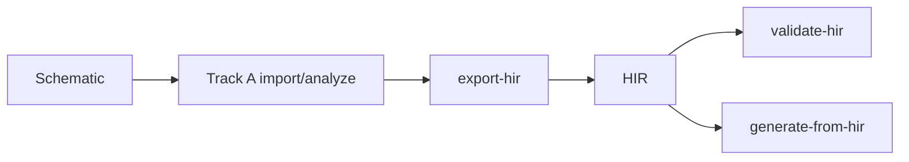

# Boardsmith Specification: Prompt → HIR Synthesizer (with optional schematic export)

## 1) Overview & Goals

### 1.1 Objective
Define a **clean, stable boundary** so a future probabilistic Boardsmith (prompt-driven synthesis) can produce the same canonical HIR consumed by the deterministic Track A compiler, without refactoring Track A internals.

### 1.2 Current baseline (repo facts)
Track A currently implements:
- Schematic import (`.sch`, `.kicad_sch`) → `HardwareGraph`. (`boardsmith-fw import`, `boardsmith-fw analyze`)
- `HardwareGraph + ComponentKnowledge` → HIR via `build_hir(...)`.
- HIR constraint validation via `solve_constraints(hir, graph)`.
- HIR-driven codegen via `generate_from_hir(hir, target=...)`, then optional LLM glue merge in `generate` command.
- Knowledge resolution chain: built-in DB → cache → minimal fallback.

### 1.3 Non-goals for this spec/session
- No Boardsmith implementation code.
- No mandatory KiCad export implementation in MVP (only contract/spec).
- No refactor of existing parser/analyzer/codegen internals in this session.

---

## 2) System Split & Contracts

## 2.1 Hard cut: deterministic compiler vs probabilistic synthesizer

### Track A: Compiler (deterministic)
**Owns and guarantees:**
1. Schematic parsing and graph extraction.
2. Canonical HIR schema + validator behavior.
3. Constraint solving/diagnostics.
4. Firmware generation from HIR.

**Must not depend on:** LLM agent logic, prompt reasoning, ranking heuristics.

### Boardsmith: Synthesizer (probabilistic)
**Owns and performs:**
1. Prompt understanding.
2. Candidate component/topology synthesis.
3. Iterative refinement against Track A validator.
4. Output packaging (HIR + BOM mandatory; schematic export optional).

**Must not call:** Track A private/internal logic by direct imports as a dependency contract.

### Stable boundary
Boardsmith talks to Track A via:
- Canonical HIR JSON schema + semantic rules.
- CLI/API contracts (`export-hir`, `validate-hir`, `generate-from-hir`, `list-components`).
- Machine-readable diagnostics format.

---

## 3) Canonical HIR (schema, versioning)

## 3.1 Canonical artifact locations

1. **Python model source of truth (runtime):**
   - `boardsmith_fw/models/hir.py` (existing, Pydantic)
2. **Schema snapshot (new, generated + versioned):**
   - `schemas/hir/v1.1.0/hir.schema.json`
3. **Docs + examples:**
   - `docs/hir_contract.md` (future)
   - `fixtures/hir/*.json` (future)

> Decision: Track A keeps runtime model; machine-facing contract is versioned JSON Schema snapshots under `schemas/hir/`.

## 3.2 HIR versioning

- Add `hir.version` as semver.
- Validation command enforces supported ranges.
- Policy:
  - `MAJOR`: breaking fields/semantics.
  - `MINOR`: additive fields (backward-compatible).
  - `PATCH`: clarifications/metadata-only.

### Compatibility rule
- Track A compiler supports: `^1.x` at MVP.
- Boardsmith must emit `version: 1.1.0` (targeting first schema that includes provenance + addresses + confidence placeholders).

## 3.3 Canonical HIR schema skeleton (v1.1.0)

```json
{
  "$schema": "https://json-schema.org/draft/2020-12/schema",
  "$id": "https://boardsmith-fw.dev/schemas/hir/v1.1.0/hir.schema.json",
  "title": "Hardware Intermediate Representation",
  "type": "object",
  "required": [
    "version",
    "source",
    "components",
    "nets",
    "bus_contracts",
    "electrical_specs",
    "init_contracts",
    "power_sequence",
    "constraints",
    "metadata"
  ],
  "properties": {
    "version": { "type": "string", "pattern": "^1\\.[0-9]+\\.[0-9]+$" },
    "source": { "type": "string", "description": "prompt|schematic|hybrid identifier" },

    "components": {
      "type": "array",
      "items": {
        "type": "object",
        "required": ["id", "name", "role", "mpn", "interface_types"],
        "properties": {
          "id": { "type": "string" },
          "name": { "type": "string" },
          "role": { "type": "string", "enum": ["mcu", "sensor", "actuator", "memory", "power", "comms", "other"] },
          "manufacturer": { "type": "string" },
          "mpn": { "type": "string" },
          "package": { "type": "string" },
          "interface_types": {
            "type": "array",
            "items": { "type": "string", "enum": ["I2C", "SPI", "UART", "GPIO", "ADC", "PWM", "CAN", "OTHER"] }
          },
          "pins": {
            "type": "array",
            "items": {
              "type": "object",
              "required": ["name"],
              "properties": {
                "name": { "type": "string" },
                "number": { "type": "string" },
                "function": { "type": "string" },
                "electrical_type": { "type": "string" }
              }
            }
          },
          "provenance": { "$ref": "#/$defs/provenance" }
        }
      }
    },

    "nets": {
      "type": "array",
      "items": {
        "type": "object",
        "required": ["name", "pins"],
        "properties": {
          "name": { "type": "string" },
          "pins": {
            "type": "array",
            "items": {
              "type": "object",
              "required": ["component_id", "pin_name"],
              "properties": {
                "component_id": { "type": "string" },
                "pin_name": { "type": "string" }
              }
            }
          },
          "is_bus": { "type": "boolean", "default": false },
          "is_power": { "type": "boolean", "default": false },
          "provenance": { "$ref": "#/$defs/provenance" }
        }
      }
    },

    "buses": {
      "type": "array",
      "default": [],
      "items": {
        "type": "object",
        "required": ["name", "type", "master_component_id", "slave_component_ids"],
        "properties": {
          "name": { "type": "string" },
          "type": { "type": "string", "enum": ["I2C", "SPI", "UART", "GPIO", "ADC", "PWM", "CAN", "OTHER"] },
          "master_component_id": { "type": "string" },
          "slave_component_ids": { "type": "array", "items": { "type": "string" } },
          "pin_mapping": {
            "type": "array",
            "items": {
              "type": "object",
              "required": ["signal", "net"],
              "properties": {
                "signal": { "type": "string" },
                "net": { "type": "string" },
                "mcu_pin_name": { "type": "string" },
                "gpio": { "type": "string" }
              }
            }
          }
        }
      }
    },

    "bus_contracts": {
      "type": "array",
      "items": {
        "type": "object",
        "required": ["bus_name", "bus_type", "master_id", "slave_ids"],
        "properties": {
          "bus_name": { "type": "string" },
          "bus_type": { "type": "string", "enum": ["I2C", "SPI", "UART"] },
          "master_id": { "type": "string" },
          "slave_ids": { "type": "array", "items": { "type": "string" } },
          "configured_clock_hz": { "type": "integer", "minimum": 0 },
          "pin_assignments": {
            "type": "object",
            "additionalProperties": { "type": "string" },
            "description": "signal->gpio"
          },
          "slave_addresses": {
            "type": "object",
            "additionalProperties": { "type": "string", "pattern": "^0x[0-9a-fA-F]+$" },
            "description": "slave_id->i2c address"
          },
          "i2c": {
            "type": "object",
            "properties": {
              "address": { "type": "string", "pattern": "^0x[0-9a-fA-F]+$" },
              "address_bits": { "type": "integer", "enum": [7, 10], "default": 7 },
              "max_clock_hz": { "type": "integer", "minimum": 1000 },
              "min_clock_hz": { "type": "integer", "minimum": 0 },
              "t_rise_ns": { "type": "integer" },
              "t_fall_ns": { "type": "integer" },
              "t_su_dat_ns": { "type": "integer" },
              "t_hd_dat_ns": { "type": "integer" },
              "t_su_sta_ns": { "type": "integer" },
              "t_buf_ns": { "type": "integer" },
              "pullup_ohm_min": { "type": "integer", "minimum": 100 },
              "pullup_ohm_max": { "type": "integer", "minimum": 100 },
              "bus_capacitance_pf_max": { "type": "integer", "minimum": 10 }
            }
          },
          "spi": {
            "type": "object",
            "properties": {
              "max_clock_hz": { "type": "integer", "minimum": 1000 },
              "mode": { "type": "integer", "enum": [0, 1, 2, 3] },
              "bit_order": { "type": "string", "enum": ["MSB", "LSB"] },
              "cs_active": { "type": "string", "enum": ["low", "high"] },
              "cs_setup_ns": { "type": "integer" },
              "cs_hold_ns": { "type": "integer" }
            }
          },
          "uart": {
            "type": "object",
            "properties": {
              "baud_rate": { "type": "integer", "minimum": 1200 },
              "data_bits": { "type": "integer", "enum": [5, 6, 7, 8, 9] },
              "stop_bits": { "type": "integer", "enum": [1, 2] },
              "parity": { "type": "string", "enum": ["none", "even", "odd"] },
              "flow_control": { "type": "string", "enum": ["none", "rts_cts", "xon_xoff"] }
            }
          },
          "provenance": { "$ref": "#/$defs/provenance" }
        }
      }
    },

    "electrical_specs": {
      "type": "array",
      "items": {
        "type": "object",
        "required": ["component_id"],
        "properties": {
          "component_id": { "type": "string" },
          "supply_voltage": { "$ref": "#/$defs/voltage" },
          "io_voltage": { "$ref": "#/$defs/voltage" },
          "logic_high_min": { "type": "number" },
          "logic_low_max": { "type": "number" },
          "current_draw": {
            "type": "object",
            "properties": {
              "typical": { "type": "number" },
              "max": { "type": "number" },
              "unit": { "type": "string", "default": "mA" }
            }
          },
          "is_5v_tolerant": { "type": "boolean" },
          "drive_strength_ma": { "type": "number" },
          "input_capacitance_pf": { "type": "number" },
          "abs_max_voltage": { "type": "number" },
          "temp_min_c": { "type": "number" },
          "temp_max_c": { "type": "number" },
          "provenance": { "$ref": "#/$defs/provenance" }
        }
      }
    },

    "init_contracts": {
      "type": "array",
      "items": {
        "type": "object",
        "required": ["component_id", "phases"],
        "properties": {
          "component_id": { "type": "string" },
          "component_name": { "type": "string" },
          "phases": {
            "type": "array",
            "items": {
              "type": "object",
              "required": ["phase", "order"],
              "properties": {
                "phase": { "type": "string", "enum": ["reset", "configure", "calibrate", "enable", "verify"] },
                "order": { "type": "integer", "minimum": 0 },
                "writes": {
                  "type": "array",
                  "items": {
                    "type": "object",
                    "required": ["reg_addr", "value"],
                    "properties": {
                      "reg_addr": { "type": "string", "pattern": "^0x[0-9a-fA-F]+$" },
                      "value": { "type": "string", "pattern": "^0x[0-9a-fA-F]+$" },
                      "description": { "type": "string" },
                      "purpose": { "type": "string" }
                    }
                  }
                },
                "reads": {
                  "type": "array",
                  "items": {
                    "type": "object",
                    "required": ["reg_addr"],
                    "properties": {
                      "reg_addr": { "type": "string", "pattern": "^0x[0-9a-fA-F]+$" },
                      "expected_value": { "type": "string", "pattern": "^0x[0-9a-fA-F]+$" },
                      "mask": { "type": "string", "pattern": "^0x[0-9a-fA-F]+$" },
                      "description": { "type": "string" },
                      "purpose": { "type": "string" }
                    }
                  }
                },
                "delay_after_ms": { "type": "integer", "minimum": 0 },
                "precondition": { "type": "string" },
                "postcondition": { "type": "string" },
                "provenance": { "$ref": "#/$defs/provenance" }
              }
            }
          }
        }
      }
    },

    "power_sequence": {
      "type": "object",
      "required": ["rails", "dependencies"],
      "properties": {
        "rails": {
          "type": "array",
          "items": {
            "type": "object",
            "required": ["name", "voltage"],
            "properties": {
              "name": { "type": "string" },
              "voltage": { "$ref": "#/$defs/voltage" },
              "max_current_ma": { "type": "number" },
              "enable_gpio": { "type": "string" },
              "startup_delay_ms": { "type": "integer", "minimum": 0 },
              "provenance": { "$ref": "#/$defs/provenance" }
            }
          }
        },
        "dependencies": {
          "type": "array",
          "items": {
            "type": "object",
            "required": ["source", "target"],
            "properties": {
              "source": { "type": "string" },
              "target": { "type": "string" },
              "min_delay_ms": { "type": "integer", "minimum": 0 },
              "description": { "type": "string" },
              "provenance": { "$ref": "#/$defs/provenance" }
            }
          }
        }
      }
    },

    "constraints": {
      "type": "array",
      "items": {
        "type": "object",
        "required": ["id", "category", "description", "severity", "status"],
        "properties": {
          "id": { "type": "string" },
          "category": { "type": "string", "enum": ["electrical", "timing", "protocol", "power", "topology", "knowledge"] },
          "description": { "type": "string" },
          "severity": { "type": "string", "enum": ["error", "warning", "info"] },
          "status": { "type": "string", "enum": ["pass", "fail", "unknown"] },
          "details": { "type": "string" },
          "affected_components": { "type": "array", "items": { "type": "string" } },
          "provenance": { "$ref": "#/$defs/provenance" }
        }
      }
    },

    "bom": {
      "type": "array",
      "description": "Mandatory for Boardsmith outputs",
      "items": {
        "type": "object",
        "required": ["line_id", "component_id", "mpn", "qty"],
        "properties": {
          "line_id": { "type": "string" },
          "component_id": { "type": "string" },
          "mpn": { "type": "string" },
          "manufacturer": { "type": "string" },
          "description": { "type": "string" },
          "qty": { "type": "number", "minimum": 1 },
          "unit_cost_estimate": { "type": "number" },
          "currency": { "type": "string", "default": "USD" },
          "availability": { "type": "string" },
          "provenance": { "$ref": "#/$defs/provenance" }
        }
      }
    },

    "metadata": {
      "type": "object",
      "required": ["created_at", "track", "confidence"],
      "properties": {
        "created_at": { "type": "string", "format": "date-time" },
        "track": { "type": "string", "enum": ["A", "B"] },
        "confidence": {
          "type": "object",
          "required": ["overall"],
          "properties": {
            "overall": { "type": "number", "minimum": 0.0, "maximum": 1.0 },
            "subscores": {
              "type": "object",
              "properties": {
                "intent": { "type": "number", "minimum": 0.0, "maximum": 1.0 },
                "components": { "type": "number", "minimum": 0.0, "maximum": 1.0 },
                "topology": { "type": "number", "minimum": 0.0, "maximum": 1.0 },
                "electrical": { "type": "number", "minimum": 0.0, "maximum": 1.0 }
              }
            },
            "explanations": { "type": "array", "items": { "type": "string" } }
          }
        },
        "assumptions": { "type": "array", "items": { "type": "string" } },
        "session_id": { "type": "string" }
      }
    }
  },

  "$defs": {
    "voltage": {
      "type": "object",
      "required": ["nominal"],
      "properties": {
        "nominal": { "type": "number" },
        "min": { "type": "number" },
        "max": { "type": "number" },
        "unit": { "type": "string", "default": "V" }
      }
    },
    "provenance": {
      "type": "object",
      "required": ["source_type", "confidence"],
      "properties": {
        "source_type": {
          "type": "string",
          "enum": ["schematic", "prompt", "builtin_db", "cache", "datasheet", "user_input", "inference"]
        },
        "source_ref": { "type": "string" },
        "confidence": { "type": "number", "minimum": 0.0, "maximum": 1.0 },
        "evidence": { "type": "array", "items": { "type": "string" } }
      }
    }
  }
}
```

### 3.4 Minimal fields Boardsmith MUST provide for Track A compile
At minimum for successful `generate-from-hir`:
1. `version`, `source`, `metadata.track = "B"`.
2. `bus_contracts[*].bus_type/master_id/slave_ids` and protocol section (`i2c`/`spi`/`uart`) where relevant.
3. `bus_contracts[*].pin_assignments` for compile target pin mapping.
4. `init_contracts[*].component_id/phases` with at least one deterministic initialization phase per active peripheral.
5. `electrical_specs` for MCU and all bus-connected devices (even if partial; unknown allowed but explicit).
6. `constraints` may be empty before validation; Track A fills/overwrites on validate.
7. `bom` must include all non-passive active components.

---

## 4) Track A Interface (export/validate/generate)

## 4.1 CLI contracts (stable boundary)

### 4.1.1 `boardsmith-fw export-hir`
Export canonical HIR from existing Track A artifacts.

```bash
boardsmith-fw export-hir \
  --graph hardware_graph.json \
  --knowledge-dir component_knowledge \
  --output out/hir.json \
  --include-constraints
```

**Behavior:**
- Loads `HardwareGraph` and resolved/explicit knowledge.
- Builds HIR via deterministic `build_hir`.
- If `--include-constraints`, runs solver and embeds results.
- Emits HIR JSON conforming to `schemas/hir/v1.1.0/hir.schema.json`.

### 4.1.2 `boardsmith-fw validate-hir`
Validate HIR schema + semantic constraints with machine-readable diagnostics.

```bash
boardsmith-fw validate-hir \
  --hir out/hir.json \
  --diagnostics out/diagnostics.json \
  --format json
```

**Exit codes:**
- `0`: valid (no error-severity fails)
- `1`: invalid (>=1 error-severity fail)
- `2`: malformed input/schema parse failure/tool error

### 4.1.3 `boardsmith-fw generate-from-hir`
Generate firmware directly from HIR without schematic.

```bash
boardsmith-fw generate-from-hir \
  --hir out/hir.json \
  --target esp32 \
  --out generated_firmware \
  --strict
```

**Behavior:**
- Validates HIR first (`--strict` blocks generation on error-level failures or unresolved required fields).
- Calls HIR codegen only; avoids raw schematic dependency.

### 4.1.4 `boardsmith-fw list-components`
Expose knowledge inventory for Boardsmith candidate selection.

```bash
boardsmith-fw list-components --format json --include-cache --category sensor
```

**Returns** built-in + cache index with normalized fields (see §4.3).

## 4.2 API boundary equivalents (Python)
A thin `boardsmith_fw/api/compiler.py` (new) module should expose:
- `export_hir(graph_path, knowledge_dir=None, include_constraints=True) -> dict`
- `validate_hir(hir: dict) -> DiagnosticsReport`
- `generate_from_hir(hir: dict, target: str, out_dir: Path, strict=True) -> GenerationSummary`
- `list_components(filters: dict) -> list[ComponentCatalogEntry]`

> Internal implementation may use existing modules, but this API is the stable boundary consumed by Boardsmith.

## 4.3 Knowledge lookup contract for Boardsmith

### 4.3.1 Query
Boardsmith queries component catalog through CLI/API only (no direct module imports assumed).

**Request fields (filtering):**
- `category`, `interface`, `voltage_range`, `max_cost`, `temp_range`, `availability`, `package`.

### 4.3.2 Response schema
Each candidate entry must include at least:
- `mpn`, `manufacturer`, `name`, `category`.
- `interface_types`.
- `electrical_ratings`: `vdd_min`, `vdd_max`, `io_voltage_*`, `is_5v_tolerant`.
- `timing_caps`: protocol max clock / mode constraints.
- `known_i2c_addresses` (if applicable, single or selectable list).
- `init_contract_coverage` (bool/score).
- `provenance` (`builtin_db` | `cache` | `external_provider`).

### 4.3.3 Minimal supply from Boardsmith to Track A
For each selected active part in HIR:
- Stable `component_id`.
- `mpn` + role.
- Bus membership and pin role mappings.
- Address (I2C) or chip-select mapping (SPI).
- Enough init contract detail for deterministic codegen.

## 4.4 Diagnostics contract (machine-readable)

`validate-hir` emits JSON:

```json
{
  "tool": "boardsmith-fw",
  "version": "0.6.0",
  "hir_version": "1.1.0",
  "valid": false,
  "summary": {
    "total": 12,
    "errors": 2,
    "warnings": 3,
    "info": 7,
    "unknown": 1
  },
  "diagnostics": [
    {
      "id": "i2c_addr.i2c0.conflict",
      "category": "protocol",
      "severity": "error",
      "status": "fail",
      "message": "Address conflict on bus i2c0: 0x76 used by U2 and U3",
      "path": "$.bus_contracts[0].slave_addresses",
      "affected_components": ["U2", "U3"],
      "suggested_fixes": [
        "Pick alternate address for one part if selectable",
        "Insert I2C mux (e.g., TCA9548A)",
        "Move one part to separate I2C bus"
      ],
      "provenance": {
        "source_type": "inference",
        "confidence": 1.0
      }
    }
  ]
}
```

**Boardsmith iteration contract:**
- Treat `severity=error,status=fail` as blocking.
- Treat `warning` as non-blocking but contributes to reduced confidence.
- `unknown` forces explicit assumption entry in `metadata.assumptions`.

---

## 5) Boardsmith Architecture & Modules

## 5.1 High-level architecture

1. **Prompt Intake & Intent Parser**
2. **Requirements Modeler**
3. **Component Candidate Finder**
4. **Topology Synthesizer**
5. **HIR Composer**
6. **Validator Loop (Track A oracle)**
7. **Output Packager (HIR + BOM + optional schematic)**
8. **Confidence & Human Checkpoint Manager**

## 5.2 Module responsibilities

### B1. `intent_parser`
Input: natural-language prompt.
Output: normalized `RequirementsSpec`:
- functional goals
- sensing/actuation modalities
- required buses/protocols
- power constraints
- target MCU/family preferences
- environmental constraints
- cost/availability preferences

### B2. `requirements_normalizer`
- Converts vague statements to typed ranges.
- Annotates unresolved ambiguities.
- Sets initial confidence per requirement.

### B3. `component_selector`
- Queries `list-components` contract.
- Ranks candidates by compatibility/coverage/confidence.
- Produces candidate sets with alternatives.
- If offline market data unavailable: emit placeholders + lower confidence + explicit assumptions.

### B4. `topology_synthesizer`
- Creates graph-like topology (components, nets, buses, power domains).
- Allocates addresses/chip-selects/pin roles.
- Generates deterministic-ish initial HIR skeleton.

### B5. `hir_composer`
- Converts synthesized topology into canonical HIR JSON.
- Ensures schema completeness for mandatory fields.
- Adds provenance for every inferred field.

### B6. `constraint_refiner`
- Calls `validate-hir` (Track A).
- Parses diagnostics.
- Applies ranked fix strategies.
- Iterates until pass / max attempts / confidence collapse.

### B7. `bom_builder`
- Generates mandatory BOM from selected components.
- Marks optional/passive placeholders where unverified.

### B8. `schematic_exporter` (optional in MVP)
- HIR → schematic topology export abstraction.
- MVP can output netlist-like intermediate; KiCad `.kicad_sch` adapter later.

### B9. `confidence_engine`
- Produces overall + per-subsystem confidence score.
- Enforces HITL gating thresholds.

## 5.3 Deterministic boundaries within Boardsmith
- Stochastic/agentic decisions are allowed up to HIR candidate generation.
- Final output must be canonical HIR + deterministic validation result from Track A.
- Any unresolved unknown must be explicit (no silent defaults).

---

## 6) Data Flows

## 6.1 Boardsmith synthesis flow



## 6.2 Track A interface usage from B



## 6.3 Track A schematic parity flow



---

## 7) MVP Definition (what we build next)

## 7.1 MVP scope (Boardsmith v0)
1. Prompt → `RequirementsSpec` for a constrained domain:
   - MCU + 1–3 I2C/SPI sensors.
2. Component selection only from Track A built-in DB + local cache.
3. Topology synthesis for single-board, single-rail (3V3/5V) designs.
4. HIR emission (`hir.json`) + mandatory BOM (`bom.json`).
5. Validation loop using `validate-hir` until:
   - valid OR
   - max 5 iterations OR
   - confidence < threshold.
6. If valid, optional call to `generate-from-hir` for smoke generation.

## 7.2 Explicitly out of MVP
- Automatic market API procurement.
- Multi-board partitioning.
- Full KiCad export fidelity (symbol/footprint placement and sheet aesthetics).
- Advanced PI/SI optimization.

## 7.3 MVP deliverables
- `boardsmith_hw/` package skeleton (next session).
- CLI command prototype:
  - `boardsmith-fw synthesize --prompt "..." --out out/`
- Artifacts:
  - `out/hir.json`
  - `out/bom.json`
  - `out/diagnostics.json`
  - `out/synthesis_report.md`

---

## 8) Roadmap (next phases)

## Phase 1 (MVP)
- Implement CLI/API boundaries on Track A side.
- Implement Boardsmith intent/selection/topology/validation loop (limited domain).

## Phase 2
- Alternative candidate set branching (N-best designs).
- Passive component synthesis (pull-ups, decoupling templates, regulator choices).
- Better address conflict remediation strategies.

## Phase 3
- Optional schematic export adapter to KiCad (`.kicad_sch`) from HIR + symbol mapping.
- BOM enrichment (cost + lifecycle + lead-time providers via plugins).

## Phase 4
- Multi-domain power sequencing synthesis.
- Multi-bus and mixed-interface optimization.
- Human preference learning / reusable design intents.

---

## 9) Acceptance Criteria & Tests

## 9.1 Contract-level acceptance criteria
1. Track A can compile from HIR alone (`generate-from-hir`) with no schematic input.
2. Track A can export HIR from schematic flow (`export-hir`).
3. Boardsmith-produced HIR validates through Track A `validate-hir`.
4. No direct import of Track A private modules in Boardsmith (only CLI/API boundary).
5. Diagnostics are machine-readable and stable.

## 9.2 Fixture plan
Create fixtures (next session):
- `fixtures/boardsmith_hw/prompt_bme280_esp32.json` (prompt + expected requirements).
- `fixtures/boardsmith_hw/hir_valid_esp32_bme280.json`.
- `fixtures/boardsmith_hw/hir_invalid_i2c_addr_conflict.json`.
- `fixtures/boardsmith_hw/hir_invalid_voltage_mismatch.json`.
- `fixtures/boardsmith_hw/bom_expected_esp32_bme280.json`.

## 9.3 Test matrix

### Unit tests (Boardsmith)
- Intent parser extracts measurable requirements.
- Component selector ranks deterministic top-1 given fixed seed.
- Topology synthesizer allocates unique I2C addresses where possible.
- Confidence engine computes score + rationale.

### Integration tests (A↔B)
- Prompt fixture → HIR → validate-hir: PASS.
- Prompt fixture with forced conflict → diagnostics include expected error IDs.
- Iterative refinement resolves at least one conflict class automatically.
- HIR → generate-from-hir creates expected firmware files.

### Regression tests
- Track A existing tests unchanged/pass.
- New commands preserve backward compatibility of current CLI workflow.

## 9.4 Determinism test rules
- For test runs, Boardsmith must support fixed random seed + deterministic ranking mode.
- Snapshot expected HIR normalized (sorted component IDs, net names stable convention).

---

## 10) Open Questions / Risks

## 10.1 Risks
1. **Hallucinated component capabilities**
   - Mitigation: allow only catalog-backed capabilities; unknown fields explicit.
2. **Schema drift**
   - Mitigation: versioned schema snapshots + compatibility tests.
3. **Overfitting to current HIR shape**
   - Mitigation: additive v1.1 fields; preserve v1.0 compatibility adapters.
4. **False confidence from warning-heavy designs**
   - Mitigation: confidence penalties for unknown/warnings; HITL gate.

## 10.2 Guardrails

### Deterministic Track A rule
- No LLM in parser, graph build, HIR validation, or constraint decision paths.
- Codegen from HIR must remain deterministic for same HIR + target.

### Boardsmith rule
- LLM allowed for synthesis reasoning only.
- Final outputs must be canonical HIR + validator diagnostics.
- **No silent fallback**: every fallback must be encoded in `metadata.assumptions` and report.

### Confidence thresholds
- `overall >= 0.85` and no error diagnostics → auto-proceed.
- `0.65 <= overall < 0.85` or warnings > threshold → require user confirmation.
- `overall < 0.65` or unresolved critical ambiguity → stop and ask user targeted questions.

### Human-in-the-loop checkpoints
Required confirmation if any:
- Safety-critical or high-current actuators.
- Missing electrical ratings for >20% active components.
- Cost/availability unknown for required production constraints.

## 10.3 Assumptions made in this spec
1. Track A command additions (`export-hir`, `validate-hir`, `generate-from-hir`, `list-components`) may not yet exist and will be added.
2. Existing HIR model currently lacks explicit `components/nets/bom/metadata.provenance`; these are introduced in v1.1.0 contract while preserving backward compatibility adapter logic.
3. Existing `report` command output is a useful precursor but not a full diagnostics contract.

---

## Appendix A — Mapping current code to future contracts

- Existing `build_hir(...)` is the core implementation for `export-hir` backend.
- Existing `solve_constraints(...)` + report serializer are precursors for `validate-hir` diagnostics.
- Existing `generate_from_hir(...)` is the backend for `generate-from-hir` command.
- Existing knowledge resolver (`builtin_db` + cache + minimal fallback) informs `list-components` initial implementation.

